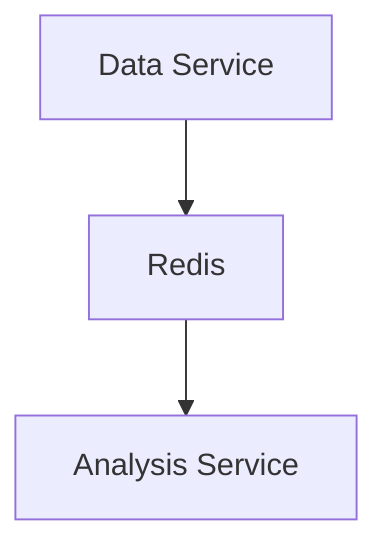

# AlphaDivision — Claude Guidelines

This file contains project-specific instructions for Claude when working on this codebase.

---

## Development Workflow

Always use **Subagent-Driven Development** with **TDD** when writing code:

1. Write a plan first (`superpowers:writing-plans`)
2. Execute via `superpowers:subagent-driven-development` — fresh subagent per task, two-stage review (spec compliance then code quality) after each task
3. Each subagent follows TDD: write failing tests first, implement, verify tests pass, commit

---


## Diagrams

Always use **Mermaid** for diagrams in README files and documentation. Never use ASCII art or plain text diagrams.

```markdown

```

---

## Comparing Options

Always use a **table** when comparing two or more options. Never use bullet lists for comparisons.

| Option | Pro | Con | Decision |
|---|---|---|---|
| Option A | ... | ... | Chosen / Rejected |
| Option B | ... | ... | Chosen / Rejected |

---

## Testing

- **Always write tests for new features** before or alongside implementation
- Every service has its own `tests/` directory with unit tests
- All external APIs must be mocked in tests — no real network calls
- **Run the full test suite before every push:**

```bash
pytest services/
```

- Integration tests must pass before merging to `main`:

```bash
docker-compose -f docker-compose.test.yml up -d
pytest tests/integration/
docker-compose -f docker-compose.test.yml down
```

---

## Configuration

**All non-secret configuration lives in `config.toml`** at the project root. Never put non-secret settings in `.env`.

| Type | Where |
|---|---|
| API keys, passwords, webhook URLs | `.env` (secrets — never commit) |
| Log level, watchlist, feature flags, thresholds | `config.toml` (committed, human-readable) |

**Rules:**
- Read config via `shared.config.load_config()` — never `os.getenv()` for non-secret values
- `load_config()` merges file values over built-in defaults, so missing keys always fall back gracefully
- Every Docker service mounts `./config.toml:/app/config.toml:ro` — add this mount when creating a new service
- Tests mock `load_config` directly (`patch("module.load_config", return_value={...})`) — never patch env vars or the filesystem for config values

**Adding a new config key:**
1. Add it to `config.toml` with a sensible default value
2. Add the same default to `_DEFAULT_CONFIG` in `shared/config.py`
3. Read it with `cfg = load_config(); value = cfg["your_key"]`
4. Add a test in `shared/tests/test_config.py` covering the new key

---

## Failure Modes & Fallbacks

For every new feature, explicitly consider and document:

- **What happens if this fails?** — Does the bot keep running or halt?
- **Is the failure silent or loud?** — Errors must be logged and alerted, never swallowed
- **What is the fallback?** — Retry logic, default values, graceful degradation
- **Does a failure here risk real money?** — If yes, fail safe (halt trading, don't guess)

Example checklist for a new data source:
- [ ] What if the API is down? → Log error, skip cycle, do not halt other services
- [ ] What if the response format changes? → Catch parse errors, alert via Discord
- [ ] What if it returns stale data? → Validate timestamps before publishing to Redis

---

## Performance & Monitoring

For every new service or feature, consider:

- **Resource usage** — Does this add significant CPU or RAM? Check against Oracle VM limits
- **Latency** — How long does this take? Is it blocking other services?
- **Health checks** — Every service must expose a `/health` endpoint
- **Alerting** — Failures, slowdowns, and unexpected behaviour must trigger a Discord/email alert
- **Logging** — Use structured logging with timestamps. Every significant action must be logged at the appropriate level (`INFO`, `WARNING`, `ERROR`)
